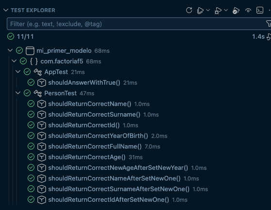

# JAVA-ej-mi-primer-modelo

## Description

### Task (es):
Se requiere que modele el concepto de una persona.

Una persona posee:  
- nombre
- apellido
- número de documento de identidad
- año de nacimiento. 
- edad (en función de su año de nacimiento)

La clase debe tener un constructor que inicialice los valores de sus respectivos atributos. Ojo, el atributo edad se calculará mediante el uso de un método.

### My realization
I used an interface and added a setter for 'YearOfBirth' with calculating 'Age' aswell. 

## Classes diagram

## Testing
